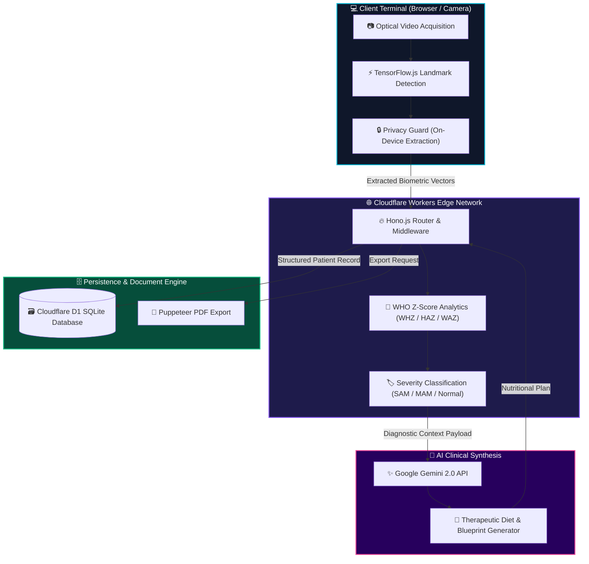

<div align="center">

  <h1>🧬 NutriScan AI</h1>
  <h3><i>Clinical Malnutrition Surveillance & Biometric Intelligence Platform</i></h3>

  <p align="center">
    <a href="https://www.who.int/tools/child-growth-standards"></a>
    <a href="https://hono.dev/"></a>
    <a href="https://workers.cloudflare.com/"></a>
    <a href="https://www.tensorflow.org/js"></a>
    <a href="https://ai.google.dev/"></a>
    <a href="https://pptr.dev/"></a>
  </p>

  <br />

  <a href="https://git.io/typing-svg">
    
  </a>

  <br />

  <p align="center">
    <b>Next-generation clinical decision support transforming standard camera optics into a precision pediatric biometric diagnostic workstation.</b>
  </p>

  <p align="center">
    <a href="#-executive-summary"><b>Executive Summary</b></a> •
    <a href="#-core-capabilities"><b>Core Capabilities</b></a> •
    <a href="#-diagnostic-classification-matrix"><b>Z-Score Matrix</b></a> •
    <a href="#-system-architecture"><b>Architecture</b></a> •
    <a href="#-technology-stack"><b>Tech Stack</b></a> •
    <a href="#-developer-execution-guide"><b>Execution Guide</b></a>
  </p>

  <sub>Engineering diagnostic accuracy for field clinicians, healthcare workers, and global health organizations.</sub>

</div>

<br />

---

## ⚡ Executive Summary

Malnutrition in early childhood remains a critical global health challenge. In resource-constrained clinical settings, early visual wasting indicators are frequently overlooked due to subtle physical manifestations and manual Z-score calculation burdens.

**NutriScan AI** bridges this critical healthcare gap by converting standard webcams and smartphone cameras into an **AI-assisted biometric diagnostic workstation**. Fusing on-device pose estimation with official **WHO Child Growth Standards** and **Google Gemini AI** clinical reasoning, the system generates instant, reliable anthropometric assessments and custom therapeutic nutrition protocols.

<br />

<table width="100%">
  <tr>
    <td width="50%" valign="top" style="background-color: #1a1016;">
      <h3 align="center">🚨 The Clinical Challenge</h3>
      <ul>
        <li><b>Undetected Wasting:</b> Early-stage acute malnutrition (limb thinning, facial muscle atrophy) often escapes conventional observation.</li>
        <li><b>Manual Calculation Errors:</b> Human miscalculations in WHZ/HAZ/WAZ Z-score tables leading to misclassified triage urgency.</li>
        <li><b>Data Fragmentations:</b> Difficulty maintaining longitudinal patient growth curves during multi-week therapeutic feeding cycles.</li>
      </ul>
    </td>
    <td width="50%" valign="top" style="background-color: #0c1a1a;">
      <h3 align="center">🛡️ The NutriScan AI Solution</h3>
      <ul>
        <li><b>Biometric Computer Vision:</b> Sub-millimeter anatomical landmark extraction using TensorFlow.js (MoveNet/MobileNet) directly in browser.</li>
        <li><b>Automated WHO Engine:</b> Instant math computation of Z-scores with automatic triaging into SAM, MAM, or Normal classifications.</li>
        <li><b>Generative Diet Blueprints:</b> Tailored therapeutic feeding protocols (RUTF, F75, F100) generated via Gemini AI reasoning.</li>
      </ul>
    </td>
  </tr>
</table>

<br />

---

## ✨ Core Capabilities

<br />

### 🔍 1. Biometric Computer Vision Engine
* **Anatomical Landmark Scan:** Extracts key physical points to measure limb proportions, rib cage prominence, and facial tissue volume.
* **Privacy-Preserving Execution:** Runs entirely on-device via TensorFlow.js. Zero patient imagery leaves the local browser terminal.
* **Lighting & Angle Auto-Validation:** Ensures optical capture quality satisfies clinical accuracy threshold before diagnostic evaluation.

<br />

### 📐 2. Precision WHO Anthropometric Calculator
* **Multi-Vector Z-Scores:** Simultaneously evaluates **WHZ** (Weight-for-Height), **HAZ** (Height-for-Age), and **WAZ** (Weight-for-Age).
* **Instant Risk Triaging:** Automates categorization into **SAM** (Severe Acute Malnutrition), **MAM** (Moderate Acute Malnutrition), or **Normal**.
* **Confidence Rating:** Outputs a statistical confidence score and diagnostic rationale breakdown for clinician verification.

<br />

### 🍱 3. Generative Therapeutic Nutrition Generator
* **Protocol Synthesis:** Leverages Google Gemini 2.0 API to formulate customized caloric intake targets and micronutrient schedules.
* **WHO Dietary Formulations:** Recommends specific ready-to-use therapeutic food plans including **RUTF**, **F-75**, and **F-100** milk diets.
* **Longitudinal Cycle Rules:** Calculates intervention duration, dietary restriction flags, and scheduled follow-up milestones.

<br />

### 📄 4. Clinical Export & Patient History Hub
* **PDF Report Generation:** Serverless Headless Chrome via `Puppeteer` compiles diagnostic certificates, patient details, and growth charts.
* **Edge Storage Hub:** Relational patient database built on Cloudflare D1 (SQLite) with type-safe Kysely ORM queries.
* **Longitudinal Trends:** Visualizes historical recovery trajectories to track treatment efficacy over time.

<br />

---

## 📐 Diagnostic Classification Matrix

NutriScan AI evaluates anthropometric inputs against standardized **WHO Child Growth Matrices (0–60 Months)** to instantly compute patient severity:

<div align="center">

| Metric Index | Target Indicator | Severity Threshold | Triage Status | Clinical Action Required |
| :---: | :---: | :---: | :---: | :--- |
| **WHZ** | Weight-for-Height | `< -3 SD` |  | Immediate Inpatient / Outpatient RUTF & Medical Protocol |
| **WHZ** | Weight-for-Height | `-3 SD to -2 SD` |  | Targeted Supplementary Feeding & Bi-weekly Monitoring |
| **HAZ** | Height-for-Age | `< -2 SD` |  | Chronic Malnutrition Protocol & Micronutrient Therapy |
| **WAZ** | Weight-for-Age | `< -2 SD` |  | Comprehensive Nutritional Support & Growth Tracking |
| **WHZ** | Weight-for-Height | `>= -2 SD` |  | Routine Wellness Check & Standard Pediatric Diet |

</div>

<br />

---

## 🏗️ System Architecture

The following diagram illustrates the complete end-to-end data pipeline:



<br />

---

## 🛠️ Technology Stack

<div align="center">

| Ecosystem Layer | Core Technology | Primary Functionality | Color Key |
| :--- | :--- | :--- | :---: |
| **App & Runtime** |   | Sub-millisecond serverless routing & Vite build system | `🔥 Orange / Blue` |
| **Language** |  | Strict end-to-end type safety across API & Database | `⚡ Royal Blue` |
| **Computer Vision** |  | Pose estimation & anatomical landmark extraction | `🧠 Amber` |
| **Generative AI** |  | AI-assisted medical reasoning & dietary synthesis | `✨ Vibrant Blue` |
| **Edge Storage** |  | Global serverless relational SQLite database | `🌐 Cloudflare Orange` |
| **Document Export** |  | High-resolution PDF clinical report compiler | `📄 Mint Teal` |
| **Clinical Standard** |  | Standardized WHO growth charts (0–60 Months) | `🩺 Deep Teal` |

</div>

<br />

---

## 💻 Developer & Execution Guide

### Environment Prerequisites
* **Node.js**: `v18.0.0` or higher
* **Package Manager**: `npm` v9+
* **Cloudflare CLI**: `wrangler` v4+

---

### Step-by-Step Local Quickstart

```bash
# 1. Clone the project repository
git clone https://github.com/your-username/nutriscan-ai.git
cd nutriscan-ai

# 2. Install all required dependencies
npm install

# 3. Set up environment variables (.env)
echo "GEMINI_API_KEY=your_google_gemini_api_key" > .env

# 4. Initialize local SQLite D1 database and seed test dataset
npm run db:migrate:local
npm run db:seed

# 5. Start the local Vite development server
npm run dev
```

> Access the interactive terminal at **`http://localhost:5173`**

---

### Command Palette Reference

```bash
npm run dev               # Start local Vite development server
npm run dev:sandbox       # Start local Wrangler Pages sandbox with D1 SQLite bindings
npm run build             # Build production static bundle
npm run db:migrate:local  # Apply migrations to local D1 database
npm run db:migrate:prod   # Apply migrations to production Cloudflare D1
npm run deploy            # Build and deploy directly to Cloudflare Pages
```

<br />

---

<div align="center">

  <br />

  <p align="center">
    
    
    
  </p>

  <h3>🧬 NutriScan AI</h3>
  <p><b>Transforming Optical Sensors into Life-Saving Biometric Diagnostic Tools</b></p>

  <p>
    Built with passion for pediatric health equity across underserved global communities.
  </p>

  <sub>© NutriScan AI • Powered by Hono, TensorFlow.js, Google Gemini & Cloudflare Workers</sub>

  <br/><br/>

</div>
