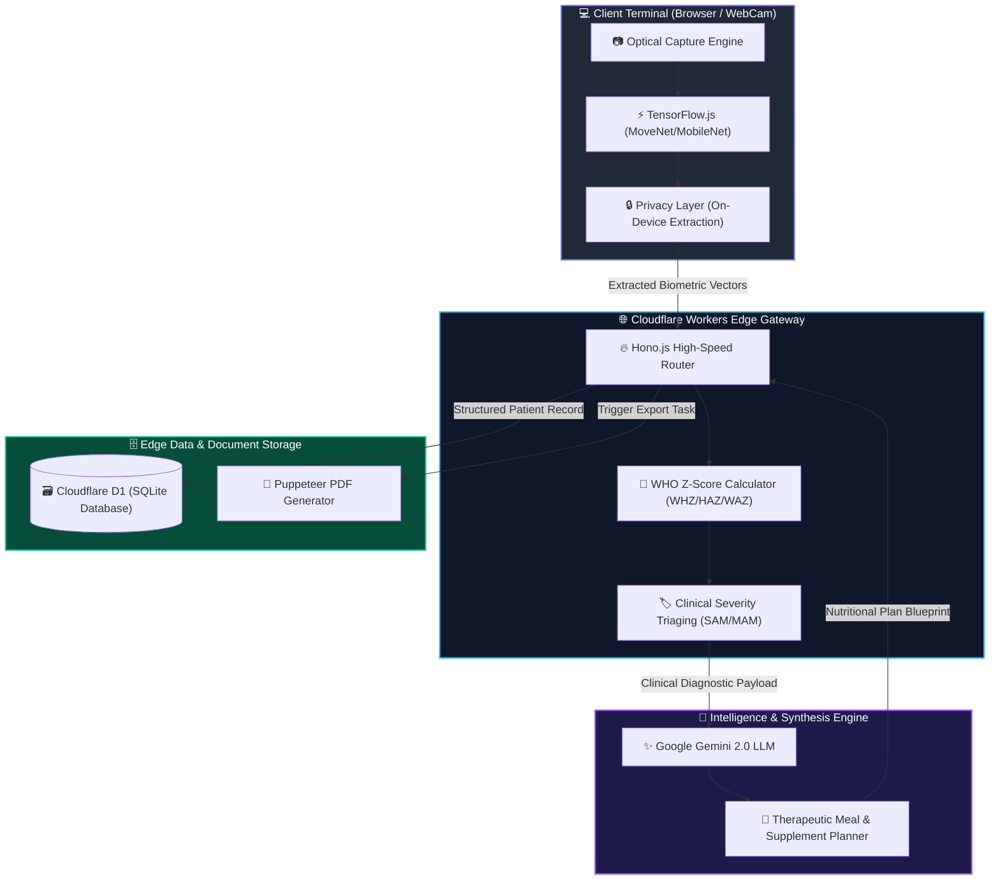

<div align="center">

  

  <br />

  [](https://www.who.int/tools/child-growth-standards)
  [](https://hono.dev/)
  [](https://workers.cloudflare.com/)
  [](https://www.tensorflow.org/js)
  [](https://ai.google.dev/)
  [](#licensing--clinical-disclaimer)

  <br />

  <a href="https://git.io/typing-svg">
    
  </a>

  <p align="center">
    <b>A flagship clinical decision support platform engineering early detection, morphological scoring, and personalized therapeutic interventions for childhood malnutrition.</b>
  </p>

  <p align="center">
    <a href="#-executive-summary">Executive Summary</a> •
    <a href="#-key-clinical--technical-capabilities">Key Capabilities</a> •
    <a href="#-system-architecture">Architecture</a> •
    <a href="#-technology-matrix">Tech Matrix</a> •
    <a href="#-deployment--execution-guide">Execution Guide</a>
  </p>

  <sub>Built for clinicians, field health workers, and pediatric care teams worldwide.</sub>

  <br/><br/>
  
  ---

</div>

<br />

## ⚡ Executive Summary

Malnutrition in early childhood remains a severe global health crisis, frequently undiagnosed during routine health checks due to subtle initial presentation and limited specialized anthropometric tools in field settings.

**NutriScan AI** transforms standard clinical hardware and camera optics into a **precision biometric diagnostic workstation**. By fusing on-device computer vision pose detection with **WHO Child Growth Standards** methodologies and high-capacity Large Language Model clinical reasoning, NutriScan AI delivers instant, reliable, and actionable therapeutic guidance at the point of care.

<table>
  <tr>
    <td width="50%" valign="top">
      <h3 align="center">🚨 The Clinical Problem</h3>
      <ul>
        <li><b>Late Diagnosis:</b> Early visual wasting indicators (mild edema, facial muscle atrophy, subtle limb thinning) often slip past manual visual evaluations.</li>
        <li><b>Field Measurement Errors:</b> Manual Z-score calculation errors leading to misclassified therapeutic treatment priority.</li>
        <li><b>Fragmented Record Keeping:</b> Longitudinal tracking failures during recovery cycles in low-resource clinic environments.</li>
      </ul>
    </td>
    <td width="50%" valign="top">
      <h3 align="center">🛡️ The NutriScan Solution</h3>
      <ul>
        <li><b>Biometric Landmark Extraction:</b> Sub-millimeter visual marker scanning with TensorFlow.js pose estimation models directly on device.</li>
        <li><b>Automated WHO Analytics:</b> Exact computation of Weight-for-Height (WHZ), Height-for-Age (HAZ), and Weight-for-Age (WAZ).</li>
        <li><b>Generative Therapeutic Plans:</b> Instant synthesis of WHO-standard diet blueprints (RUTF, F75, F100) tuned to biometric severity.</li>
      </ul>
    </td>
  </tr>
</table>

<br />

---

## ✨ Key Clinical & Technical Capabilities

<div align="center">

| Feature Module | Technical Implementation | Clinical Value & Deliverable |
| :--- | :--- | :--- |
| **🔍 Computer Vision Diagnostic Engine** | TensorFlow.js (MoveNet / MobileNet Pose Estimation) | Identifies anatomical landmarks for wasting detection (limb ratio, rib visibility, facial volume) while preserving zero-data-leakage privacy on client browser. |
| **📐 WHO Z-Score Analytics Engine** | Mathematical statistical normalization against WHO Growth Matrices | Computes exact **WHZ**, **HAZ**, and **WAZ** scores; automatically triages patients into **SAM** (Severe Acute Malnutrition), **MAM**, or **Normal**. |
| **🍱 Generative Nutritional Blueprints** | Google Gemini 2.0 API (`@google/generative-ai`) | Synthesizes personalized meal cycles, caloric requirements, micro-nutrient supplements, and therapeutic protocols (RUTF, F75, F100). |
| **📑 High-Fidelity Clinical Reports** | Serverless Headless Chrome (`Puppeteer` PDF Engine) | Generates print-ready diagnostic certificates, growth trend charts, and referral documentations directly from patient sessions. |
| **📊 Edge Database & Records Hub** | Cloudflare Workers + D1 SQLite + Kysely Type-Safe ORM | Fast, resilient patient record storage, search, multi-parameter filtering, and longitudinal recovery trend visualization. |

</div>

<br />

---

## 🏗️ System Architecture

The following diagram illustrates the end-to-end data pipeline from initial optical acquisition to edge deployment and PDF generation:



<br />

---

## 🛠️ Technology Matrix

<div align="center">

| Domain | Technology / Framework | Function in NutriScan AI |
| :--- | :--- | :--- |
| **Frontend Architecture** |   | Ultra-fast build toolchain & type-safe application state |
| **Edge Server Framework** |  | Lightweight, sub-millisecond API route handler on edge workers |
| **Computer Vision Engine** |  | On-device pose estimation and biometric landmark calculation |
| **Clinical Reasoning AI** |  | AI insight synthesis for custom dietary and medical plans |
| **Database & Cloud Storage** |  | Serverless relational SQLite database at the network edge |
| **Document Export Engine** |  | Dynamic clinical PDF report generation |
| **Clinical Standard Base** |  | Normalized growth tables for WHZ, HAZ, WAZ Z-Scores |

</div>

<br />

---

## 💻 Deployment & Execution Guide

### Prerequisites

Ensure your local development environment meets the following specifications:
* **Node.js**: `v18.0.0` or higher
* **Package Manager**: `npm` v9+
* **Cloudflare CLI**: `wrangler` v4+

---

### Step-by-Step Local Setup

1. **Clone the Repository**
   ```bash
   git clone https://github.com/your-username/nutriscan-ai.git
   cd nutriscan-ai
   ```

2. **Install Core Dependencies**
   ```bash
   npm install
   ```

3. **Configure Environment Variables**
   Create a `.env` file in the root directory:
   ```env
   GEMINI_API_KEY=your_google_gemini_api_key_here
   ```

4. **Initialize Local Database & Seed Mock Data**
   ```bash
   npm run db:migrate:local
   npm run db:seed
   ```

5. **Launch Interactive Development Server**
   ```bash
   npm run dev
   ```
   *Access the Clinical Suite interface at:* `http://localhost:5173`

---

### Command Palette Reference

| Script Command | Action |
| :--- | :--- |
| `npm run dev` | Starts Vite local development server |
| `npm run dev:sandbox` | Runs Cloudflare Pages sandbox environment with local D1 bindings |
| `npm run build` | Compiles application assets for production |
| `npm run db:migrate:local` | Applies database schema migrations to local SQLite D1 instance |
| `npm run db:migrate:prod` | Applies database schema migrations to production Cloudflare D1 |
| `npm run deploy` | Builds and deploys the application directly to Cloudflare Pages |

<br />

---

## 📄 Licensing & Clinical Disclaimer

> [!IMPORTANT]
> **Clinical Decision Support Notice**
> 
> NutriScan AI is designed solely as a **clinical decision support system (CDSS)** to assist licensed medical professionals, pediatricians, and field healthcare officers. It is **not** an autonomous diagnostic device. All AI-generated diagnostic indicators, Z-score calculations, and therapeutic nutritional blueprints must be reviewed and authorized by qualified medical personnel prior to clinical administration.

Distributed under the **MIT License**. See `LICENSE` for full details.

<br />

---

<div align="center">

  

  <br />

  ### 🧬 NutriScan AI Clinical Suite

  <b>Engineering Early Detection • Empowering Global Child Healthcare</b>

  <br />

  [](https://github.com/your-username/nutriscan-ai)
  [](https://github.com/your-username/nutriscan-ai)

  <br />

  <sub>Crafted with precision for pediatric health equity across underserved global communities.</sub>

</div>
