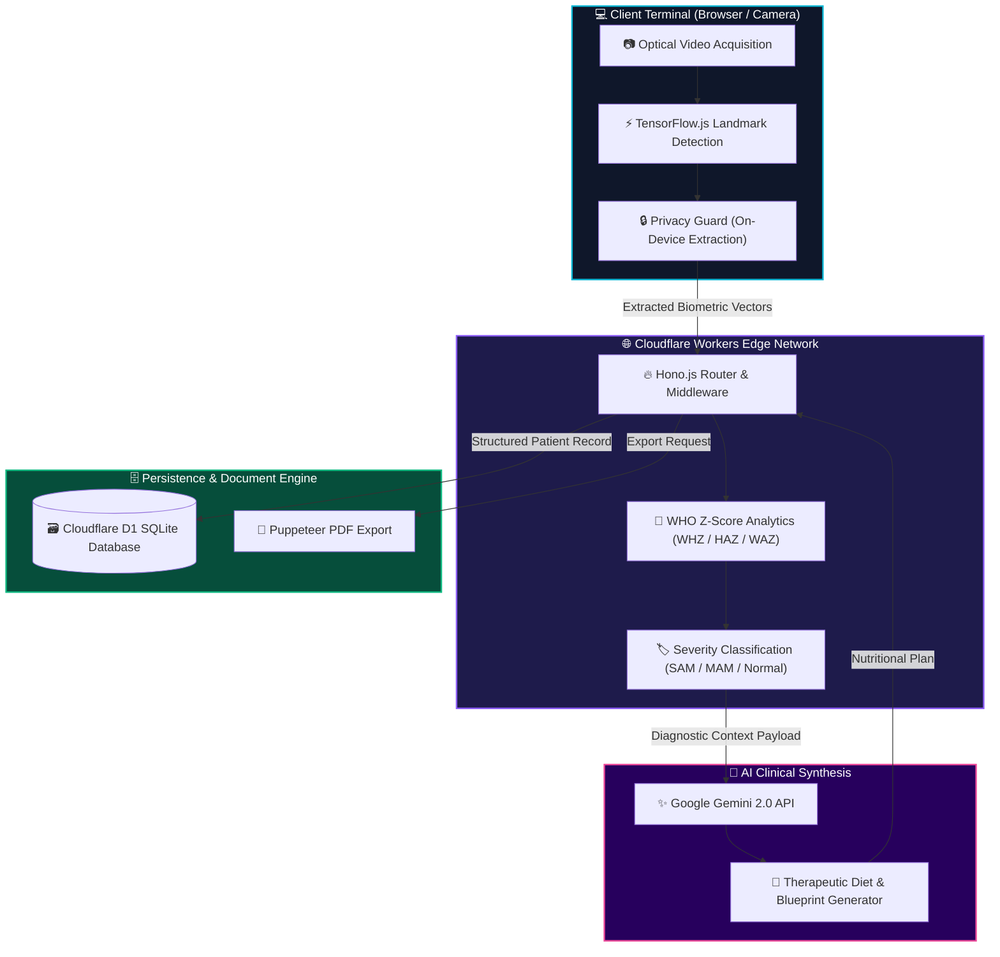

<div align="center">

  <h1><font color="#06B6D4">🧬 NutriScan AI</font></h1>
  <h3><font color="#EC4899"><i>Clinical Malnutrition Surveillance & Biometric Intelligence Platform</i></font></h3>

  <p align="center">
    <a href="https://www.who.int/tools/child-growth-standards"></a>
    <a href="https://hono.dev/"></a>
    <a href="https://workers.cloudflare.com/"></a>
    <a href="https://www.tensorflow.org/js"></a>
    <a href="https://ai.google.dev/"></a>
    <a href="https://pptr.dev/"></a>
  </p>

  <br />

  <a href="https://git.io/typing-svg">
    
  </a>

  <br />

  <p align="center">
    <font color="#38BDF8"><b>Next-generation clinical decision support transforming standard camera optics into a precision pediatric biometric diagnostic workstation.</b></font>
  </p>

  <p align="center">
    <a href="#-executive-summary"><font color="#06B6D4"><b>Executive Summary</b></font></a> •
    <a href="#-core-capabilities"><font color="#EC4899"><b>Core Capabilities</b></font></a> •
    <a href="#-diagnostic-classification-matrix"><font color="#F59E0B"><b>Z-Score Matrix</b></font></a> •
    <a href="#-system-architecture"><font color="#8B5CF6"><b>Architecture</b></font></a> •
    <a href="#-technology-stack"><font color="#10B981"><b>Tech Stack</b></font></a> •
    <a href="#-developer-execution-guide"><font color="#38BDF8"><b>Execution Guide</b></font></a>
  </p>

  <sub><font color="#94A3B8">Engineering diagnostic accuracy for field clinicians, healthcare workers, and global health organizations.</font></sub>

</div>

<br />

---

## <font color="#06B6D4">⚡ Executive Summary</font>

Malnutrition in early childhood remains a critical global health challenge. In resource-constrained clinical settings, early visual wasting indicators are frequently overlooked due to subtle physical manifestations and manual Z-score calculation burdens.

<font color="#38BDF8"><b>NutriScan AI</b></font> bridges this critical healthcare gap by converting standard webcams and smartphone cameras into an <font color="#EC4899"><b>AI-assisted biometric diagnostic workstation</b></font>. Fusing on-device pose estimation with official <font color="#F59E0B"><b>WHO Child Growth Standards</b></font> and <font color="#8B5CF6"><b>Google Gemini AI</b></font> clinical reasoning, the system generates instant, reliable anthropometric assessments and custom therapeutic nutrition protocols.

<br />

<table width="100%">
  <tr>
    <td width="50%" valign="top" style="background-color: #1a1016; border: 1px solid #EC4899;">
      <h3 align="center"><font color="#F43F5E">🚨 The Clinical Challenge</font></h3>
      <ul>
        <li><font color="#FB7185"><b>Undetected Wasting:</b></font> Early-stage acute malnutrition (limb thinning, facial muscle atrophy) often escapes conventional observation.</li>
        <li><font color="#FB7185"><b>Manual Calculation Errors:</b></font> Human miscalculations in WHZ/HAZ/WAZ Z-score tables leading to misclassified triage urgency.</li>
        <li><font color="#FB7185"><b>Data Fragmentations:</b></font> Difficulty maintaining longitudinal patient growth curves during multi-week therapeutic feeding cycles.</li>
      </ul>
    </td>
    <td width="50%" valign="top" style="background-color: #0c1a1a; border: 1px solid #06B6D4;">
      <h3 align="center"><font color="#38BDF8">🛡️ The NutriScan AI Solution</font></h3>
      <ul>
        <li><font color="#2DD4BF"><b>Biometric Computer Vision:</b></font> Sub-millimeter anatomical landmark extraction using TensorFlow.js (MoveNet/MobileNet) directly in browser.</li>
        <li><font color="#2DD4BF"><b>Automated WHO Engine:</b></font> Instant math computation of Z-scores with automatic triaging into SAM, MAM, or Normal classifications.</li>
        <li><font color="#2DD4BF"><b>Generative Diet Blueprints:</b></font> Tailored therapeutic feeding protocols (RUTF, F75, F100) generated via Gemini AI reasoning.</li>
      </ul>
    </td>
  </tr>
</table>

<br />

---

## <font color="#EC4899">✨ Core Capabilities</font>

<br />

### <font color="#06B6D4">🔍 1. Biometric Computer Vision Engine</font>
* <font color="#38BDF8"><b>Anatomical Landmark Scan:</b></font> Extracts key physical points to measure limb proportions, rib cage prominence, and facial tissue volume.
* <font color="#38BDF8"><b>Privacy-Preserving Execution:</b></font> Runs entirely on-device via TensorFlow.js. Zero patient imagery leaves the local browser terminal.
* <font color="#38BDF8"><b>Lighting & Angle Auto-Validation:</b></font> Ensures optical capture quality satisfies clinical accuracy threshold before diagnostic evaluation.

<br />

### <font color="#F59E0B">📐 2. Precision WHO Anthropometric Calculator</font>
* <font color="#FBBF24"><b>Multi-Vector Z-Scores:</b></font> Simultaneously evaluates <font color="#38BDF8"><b>WHZ</b></font> (Weight-for-Height), <font color="#EC4899"><b>HAZ</b></font> (Height-for-Age), and <font color="#8B5CF6"><b>WAZ</b></font> (Weight-for-Age).
* <font color="#FBBF24"><b>Instant Risk Triaging:</b></font> Automates categorization into <font color="#F43F5E"><b>SAM</b></font> (Severe Acute Malnutrition), <font color="#F59E0B"><b>MAM</b></font> (Moderate Acute Malnutrition), or <font color="#10B981"><b>Normal</b></font>.
* <font color="#FBBF24"><b>Confidence Rating:</b></font> Outputs a statistical confidence score and diagnostic rationale breakdown for clinician verification.

<br />

### <font color="#8B5CF6">🍱 3. Generative Therapeutic Nutrition Generator</font>
* <font color="#C084FC"><b>Protocol Synthesis:</b></font> Leverages Google Gemini 2.0 API to formulate customized caloric intake targets and micronutrient schedules.
* <font color="#C084FC"><b>WHO Dietary Formulations:</b></font> Recommends specific ready-to-use therapeutic food plans including <font color="#EC4899"><b>RUTF</b></font>, <font color="#F59E0B"><b>F-75</b></font>, and <font color="#06B6D4"><b>F-100</b></font> milk diets.
* <font color="#C084FC"><b>Longitudinal Cycle Rules:</b></font> Calculates intervention duration, dietary restriction flags, and scheduled follow-up milestones.

<br />

### <font color="#10B981">📄 4. Clinical Export & Patient History Hub</font>
* <font color="#34D399"><b>PDF Report Generation:</b></font> Serverless Headless Chrome via `Puppeteer` compiles diagnostic certificates, patient details, and growth charts.
* <font color="#34D399"><b>Edge Storage Hub:</b></font> Relational patient database built on Cloudflare D1 (SQLite) with type-safe Kysely ORM queries.
* <font color="#34D399"><b>Longitudinal Trends:</b></font> Visualizes historical recovery trajectories to track treatment efficacy over time.

<br />

---

## <font color="#F59E0B">📐 Diagnostic Classification Matrix</font>

NutriScan AI evaluates anthropometric inputs against standardized <font color="#06B6D4"><b>WHO Child Growth Matrices (0–60 Months)</b></font> to instantly compute patient severity:

<div align="center">

| Metric Index | Target Indicator | Severity Threshold | Triage Status | Clinical Action Required |
| :---: | :---: | :---: | :---: | :--- |
| <font color="#06B6D4"><b>WHZ</b></font> | Weight-for-Height | `< -3 SD` |  | <font color="#F43F5E"><b>Immediate Inpatient / Outpatient RUTF & Medical Protocol</b></font> |
| <font color="#06B6D4"><b>WHZ</b></font> | Weight-for-Height | `-3 SD to -2 SD` |  | <font color="#F59E0B"><b>Targeted Supplementary Feeding & Bi-weekly Monitoring</b></font> |
| <font color="#EC4899"><b>HAZ</b></font> | Height-for-Age | `< -2 SD` |  | <font color="#C084FC"><b>Chronic Malnutrition Protocol & Micronutrient Therapy</b></font> |
| <font color="#8B5CF6"><b>WAZ</b></font> | Weight-for-Age | `< -2 SD` |  | <font color="#38BDF8"><b>Comprehensive Nutritional Support & Growth Tracking</b></font> |
| <font color="#10B981"><b>WHZ</b></font> | Weight-for-Height | `>= -2 SD` |  | <font color="#34D399"><b>Routine Wellness Check & Standard Pediatric Diet</b></font> |

</div>

<br />

---

## <font color="#8B5CF6">🏗️ System Architecture</font>

The following diagram illustrates the complete end-to-end data pipeline:



<br />

---

## <font color="#10B981">🛠️ Technology Stack</font>

<div align="center">

| Ecosystem Layer | Core Technology | Primary Functionality |
| :--- | :--- | :--- |
| <font color="#FF6B00"><b>App & Runtime</b></font> |   | Sub-millisecond serverless routing & Vite build system |
| <font color="#38BDF8"><b>Language</b></font> |  | Strict end-to-end type safety across API & Database |
| <font color="#8B5CF6"><b>Computer Vision</b></font> |  | Pose estimation & anatomical landmark extraction |
| <font color="#EC4899"><b>Generative AI</b></font> |  | AI-assisted medical reasoning & dietary synthesis |
| <font color="#F97316"><b>Edge Storage</b></font> |  | Global serverless relational SQLite database |
| <font color="#10B981"><b>Document Export</b></font> |  | High-resolution PDF clinical report compiler |
| <font color="#06B6D4"><b>Clinical Standard</b></font> |  | Standardized WHO growth charts (0–60 Months) |

</div>

<br />

---

## <font color="#38BDF8">💻 Developer & Execution Guide</font>

### <font color="#06B6D4">Environment Prerequisites</font>
* **Node.js**: `v18.0.0` or higher
* **Package Manager**: `npm` v9+
* **Cloudflare CLI**: `wrangler` v4+

---

### <font color="#EC4899">Step-by-Step Local Quickstart</font>

```bash
# 1. Clone the project repository
git clone https://github.com/your-username/nutriscan-ai.git
cd nutriscan-ai

# 2. Install all required dependencies
npm install

# 3. Set up environment variables (.env)
echo "GEMINI_API_KEY=your_google_gemini_api_key" > .env

# 4. Initialize local SQLite D1 database and seed test dataset
npm run db:migrate:local
npm run db:seed

# 5. Start the local Vite development server
npm run dev
```

> <font color="#38BDF8">Access the interactive terminal at</font> **`http://localhost:5173`**

---

### <font color="#F59E0B">Command Palette Reference</font>

```bash
npm run dev               # Start local Vite development server
npm run dev:sandbox       # Start local Wrangler Pages sandbox with D1 SQLite bindings
npm run build             # Build production static bundle
npm run db:migrate:local  # Apply migrations to local D1 database
npm run db:migrate:prod   # Apply migrations to production Cloudflare D1
npm run deploy            # Build and deploy directly to Cloudflare Pages
```

<br />

---

<div align="center">

  <br />

  <p align="center">
    
    
    
  </p>

  <h2><font color="#06B6D4">🧬 NutriScan AI</font></h2>
  <p><font color="#EC4899"><b>Transforming Optical Sensors into Life-Saving Biometric Diagnostic Tools</b></font></p>

  <p>
    <font color="#38BDF8">Built with passion for pediatric health equity across underserved global communities.</font>
  </p>

  <sub><font color="#94A3B8">© NutriScan AI • Powered by Hono, TensorFlow.js, Google Gemini & Cloudflare Workers</font></sub>

  <br/><br/>

</div>
