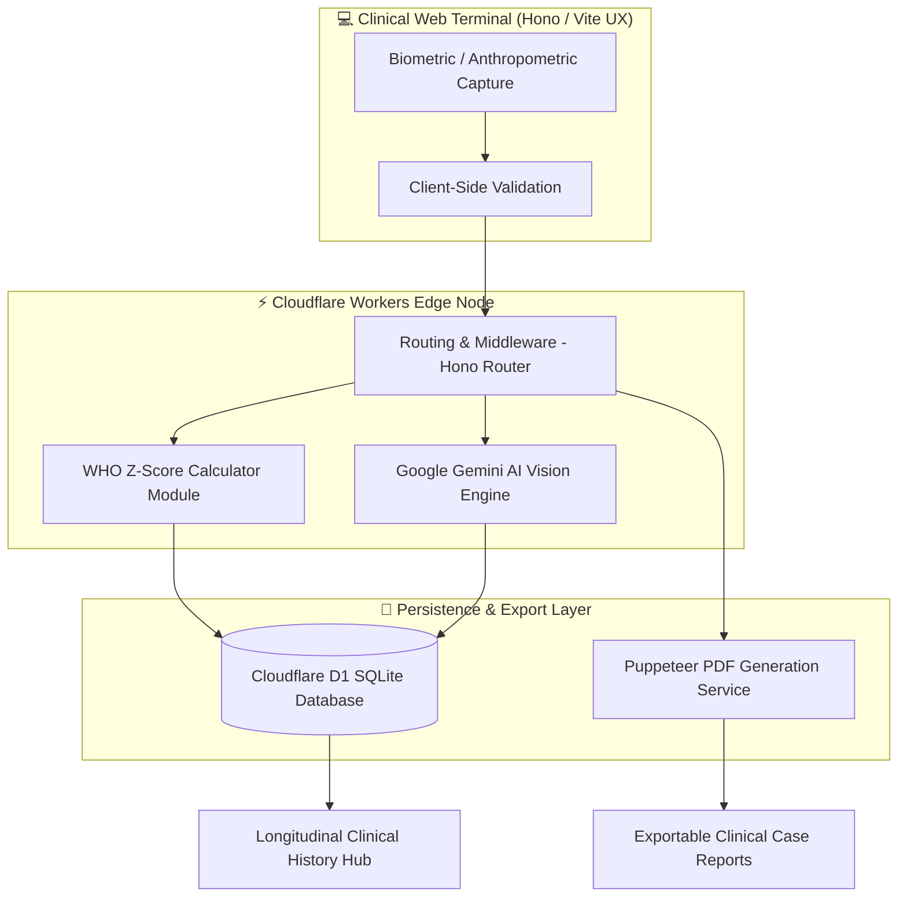

<div align="center">

  <h1>🧬 NutriScan AI</h1>
  <h3>Clinical Malnutrition Surveillance & Biometric Diagnostic Suite</h3>

  <p>
    <b>An enterprise-grade Clinical Decision Support System (CDSS) for early detection, WHO-standard anthropometric analysis, and longitudinal management of childhood malnutrition.</b>
  </p>

  <p>
    <a href="https://hono.dev"></a>
    <a href="https://workers.cloudflare.com/"></a>
    <a href="https://deepmind.google/technologies/gemini/"></a>
    <a href="https://www.who.int/"></a>
    <a href="https://sqlite.org/"></a>
  </p>

  <p>
    <a href="#-key-capabilities">Key Features</a> •
    <a href="#-system-architecture">Architecture</a> •
    <a href="#-tech-stack">Tech Stack</a> •
    <a href="#-quick-start">Quick Start</a> •
    <a href="#-clinical-disclaimer">Clinical Safety</a>
  </p>

  <br />
</div>

---

### 💡 Executive Vision

Malnutrition remains a critical global health challenge that often escapes detection during routine clinical checkups. **NutriScan AI** transforms biometric capture into actionable diagnostic intelligence. By pairing high-fidelity computer vision with **World Health Organization (WHO) Growth Standards**, NutriScan AI equips healthcare providers with rapid diagnostic triage, personalized nutritional care blueprints, and patient history surveillance.

---

### ✨ Key Capabilities

<table>
  <tr>
    <td width="50%" valign="top">
      <h4>🔍 1. AI Morphological Diagnostic Engine</h4>
      <ul>
        <li><b>Biometric Landmark Analysis:</b> Evaluates physical indicators of wasting (limb circumference ratios, facial geometry, loose skin folds).</li>
        <li><b>Computer Vision Diagnostic Triage:</b> Automated body proportion validation against clinical markers using multimodal AI vision.</li>
        <li><b>Privacy-Preserving Execution:</b> Zero raw imagery stored; extracts structured biometrics directly at the terminal boundary.</li>
      </ul>
    </td>
    <td width="50%" valign="top">
      <h4>📐 2. WHO Precision Anthropometrics</h4>
      <ul>
        <li><b>Z-Score Calculator Engine:</b> Real-time standard deviation scoring for <b>WHZ</b> (Weight-for-Height), <b>HAZ</b> (Height-for-Age), and <b>WAZ</b> (Weight-for-Age).</li>
        <li><b>Diagnostic Badging:</b> Instant clinical classification into <b>SAM</b> (Severe Acute Malnutrition), <b>MAM</b> (Moderate Acute Malnutrition), or <b>Normal</b> status.</li>
        <li><b>Statistical Confidence:</b> Algorithmic confidence scoring backed by WHO percentile tables and deterministic fallback logic.</li>
      </ul>
    </td>
  </tr>
  <tr>
    <td width="50%" valign="top">
      <h4>🍱 3. Dynamic Nutritional Blueprints</h4>
      <ul>
        <li><b>Prescriptive Dietary Plans:</b> Calorie and macro-balanced clinical meal cycles tailored to patient weight and malnutrition severity.</li>
        <li><b>Therapeutic Protocol Integration:</b> Automated supplement dosage recommendations following WHO guidelines (RUTF, F75, F100).</li>
        <li><b>Dietary Duration & Limits:</b> Custom recovery timelines, intervention phases, and food restriction alerts.</li>
      </ul>
    </td>
    <td width="50%" valign="top">
      <h4>📊 4. Longitudinal Surveillance & Reporting</h4>
      <ul>
        <li><b>Clinical History Hub:</b> Centralized patient records registry with multi-parameter filtering, search, and status tracking.</li>
        <li><b>High-Fidelity PDF Export:</b> Server-side PDF generation powered by Puppeteer for official clinical case files.</li>
        <li><b>Growth Vector Tracking:</b> Track longitudinal recovery vectors across treatment cycles to evaluate intervention success.</li>
      </ul>
    </td>
  </tr>
</table>

---

### 🏗️ System Architecture



---

### 🛠️ Tech Stack

| Domain | Technology | Description |
| :--- | :--- | :--- |
| **Logic & Framework** |   | High-performance edge router with Vite dev server integration |
| **Edge Serverless** |  | Sub-millisecond serverless deployment via Wrangler |
| **AI Infrastructure** |  | `@google/generative-ai` multimodal vision & diagnostic analysis |
| **Persistence Layer** |  | Distributed serverless SQL database managed via migrations |
| **PDF & Export Engine** |  | Headless browser engine for generating clinical reports |
| **Standards Standard** |  | World Health Organization anthropometric reference tables |

---

### 🚀 Quick Start

#### Prerequisites
* **Node.js**: v18.0.0 or higher
* **npm**: v9.0.0 or higher
* **Cloudflare Wrangler CLI**: (Optional, included in devDependencies)

#### Installation & Development

1. **Clone the Repository**
   ```bash
   git clone https://github.com/your-username/nutriscan-ai.git
   cd nutriscan-ai
   ```

2. **Install Dependencies**
   ```bash
   npm install
   ```

3. **Initialize Local Database & Migrations**
   ```bash
   npm run db:migrate:local
   ```

4. **Launch Local Development Server**
   ```bash
   npm run dev
   ```
   Open `http://localhost:5173/` in your browser to access the suite.

#### Deployment Commands

```bash
# Apply migrations to production Cloudflare D1 instance
npm run db:migrate:prod

# Build & deploy application to Cloudflare Pages / Workers
npm run deploy
```

---

### 📂 Repository Structure

```
nutriscan-ai/
├── src/
│   ├── index.tsx              # Main Hono Application Router & UI Shell
│   ├── renderer.tsx           # JSX / HTML Layout Renderer
│   ├── lib/
│   │   ├── assessment.ts      # WHO Z-Score & Anthropometric Computation Engine
│   │   └── dietplan.ts        # Prescriptive Meal Cycle & Supplement Generator
│   ├── routes/
│   │   ├── assessment.ts      # Clinical Patient Assessment API Routes
│   │   ├── export.ts          # PDF Export Service (Puppeteer Integration)
│   │   └── report.ts          # Report Presentation & Rendering Routes
│   └── types/                 # TypeScript Data Schema Definitions
├── migrations/                # Cloudflare D1 Database SQL Migrations
├── seed.sql                   # Database Initial Seeding Script
├── wrangler.jsonc             # Cloudflare Workers & D1 Configuration
└── vite.config.ts             # Vite Build Configuration
```

---

### 🩺 Clinical Disclaimer

> [!IMPORTANT]
> **NutriScan AI is a Clinical Decision Support System (CDSS) intended to assist qualified healthcare professionals.**
> It is designed to augment—not replace—professional medical judgment, physical examination, and laboratory diagnostic testing. All therapeutic nutritional interventions and supplement prescriptions generated by this software must be validated by a licensed physician or clinical nutritionist prior to administration.

---

<div align="center">
  <sub>Built with dedication for global child health and nutrition surveillance.</sub>
</div>
