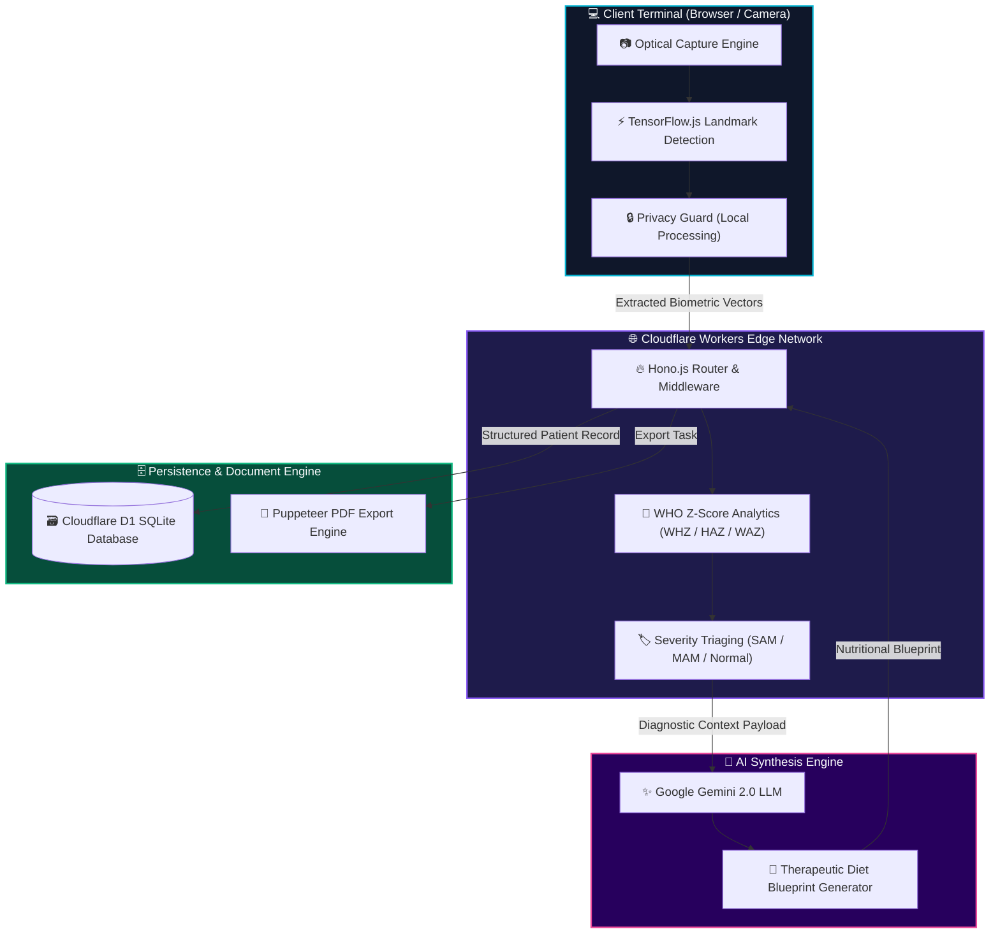

<div align="center">

  <h1>🧬 NutriScan AI</h1>
  <h3><i>Clinical Malnutrition Surveillance & Biometric Intelligence Platform</i></h3>

  <p align="center">
    <a href="https://www.who.int/tools/child-growth-standards"></a>
    <a href="https://hono.dev/"></a>
    <a href="https://workers.cloudflare.com/"></a>
    <a href="https://www.tensorflow.org/js"></a>
    <a href="https://ai.google.dev/"></a>
    <a href="https://pptr.dev/"></a>
  </p>

  <br />

  <a href="https://git.io/typing-svg">
    
  </a>

  <br />

  <p align="center">
    <b>Next-generation clinical decision support transforming standard camera optics into a precision pediatric biometric diagnostic workstation.</b>
  </p>

  <p align="center">
    <a href="#-executive-summary"><b>Executive Summary</b></a> •
    <a href="#-core-capabilities"><b>Core Capabilities</b></a> •
    <a href="#-diagnostic-classification-matrix"><b>Z-Score Matrix</b></a> •
    <a href="#-system-architecture"><b>Architecture</b></a> •
    <a href="#-technology-stack"><b>Tech Stack</b></a> •
    <a href="#-developer-execution-guide"><b>Execution Guide</b></a>
  </p>

</div>

<br />

> [!NOTE]
> ### 💡 Platform Highlights
> - **Biometric Intelligence:** On-device computer vision analyzing anatomical wasting markers in real-time.
> - **WHO Matrix Normalization:** Automated computation of **WHZ**, **HAZ**, and **WAZ** standard statistical scores.
> - **Edge Serverless Infrastructure:** Sub-millisecond global execution powered by **Hono.js** and **Cloudflare D1**.

<br />

---

## ⚡ Executive Summary

Childhood malnutrition represents a critical global healthcare emergency. In field clinics and low-resource medical environments, early wasting indicators frequently go undetected due to subtle physical manifestations and manual z-score calculation workloads.

**NutriScan AI** transforms everyday webcams and mobile cameras into a **high-precision clinical diagnostic suite**. Combining client-side pose estimation with official **WHO Growth Standards** and **Google Gemini AI** clinical reasoning, NutriScan AI empowers medical staff with instant diagnostic clarity.

<br />

> [!CAUTION]
> ### 🚨 The Clinical Challenge
> - **Undetected Wasting:** Early-stage acute malnutrition (limb circumference loss, subtle rib prominence) slips past routine visual inspection.
> - **Manual Calculation Errors:** Human error during manual WHO growth chart cross-referencing causes misclassified triage priority.
> - **Fragmented Tracking:** High drop-off rate during multi-week therapeutic feeding recovery cycles.

<br />

> [!TIP]
> ### 🛡️ The NutriScan AI Solution
> - **Biometric Vision Scan:** Sub-millimeter landmark extraction via `TensorFlow.js` running 100% locally in-browser for total patient privacy.
> - **Automated WHO Engine:** Instant mathematical evaluation of Z-scores with automatic triaging into , , or .
> - **Generative Diet Blueprints:** Tailored therapeutic feeding protocols (`RUTF`, `F75`, `F100`) synthesized via `Google Gemini 2.0` AI reasoning.

<br />

---

## ✨ Core Capabilities

<br />

### 🔍 1. Biometric Computer Vision Engine
> [!IMPORTANT]
> **Privacy-First On-Device AI Execution**  
> All computer vision processing happens on the client device using `TensorFlow.js` (`MoveNet` / `MobileNet`). Zero patient images are uploaded or transmitted.

* **Anatomical Landmark Extraction:** Measures limb ratios, rib cage prominence, and facial tissue volume.
* **Optical Quality Validation:** Automatically assesses ambient lighting and camera angle before starting diagnostics.

<br />

### 📐 2. Precision WHO Anthropometric Calculator
* **Multi-Vector Normalization:** Evaluates    scores simultaneously.
* **Confidence Scoring:** Outputs statistical confidence metrics alongside full clinical logic breakdowns.

<br />

### 🍱 3. Generative Therapeutic Nutrition Generator
* **AI Clinical Synthesis:** Leverages `Google Gemini 2.0` to generate customized caloric, fluid, and micronutrient schedules.
* **WHO Therapeutic Standards:** Formulates specific feeding plans featuring , , and .

<br />

### 📄 4. Clinical Export & Patient History Hub
* **PDF Report Compiler:** Serverless Headless Chrome via `Puppeteer` builds print-ready medical records.
* **Edge Relational Database:** High-speed patient record storage on `Cloudflare D1` (SQLite) via type-safe `Kysely` queries.

<br />

---

## 📐 Diagnostic Classification Matrix

NutriScan AI evaluates patient anthropometrics against standardized **WHO Growth Matrices (0–60 Months)**:

<div align="center">

| Metric Index | Target Indicator | Severity Threshold | Triage Status | Clinical Action Plan |
| :---: | :---: | :---: | :---: | :--- |
| **WHZ** | Weight-for-Height | `< -3 SD` |  | Immediate Outpatient / Inpatient RUTF Medical Protocol |
| **WHZ** | Weight-for-Height | `-3 SD to -2 SD` |  | Targeted Supplementary Feeding & Bi-weekly Checkups |
| **HAZ** | Height-for-Age | `< -2 SD` |  | Chronic Stunting Intervention & Micronutrient Protocol |
| **WAZ** | Weight-for-Age | `< -2 SD` |  | Pediatric Caloric Supplementation & Growth Tracking |
| **WHZ** | Weight-for-Height | `>= -2 SD` |  | Routine Standard Pediatric Care & Monitoring |

</div>

<br />

---

## 🏗️ System Architecture



<br />

---

## 🛠️ Technology Stack

<div align="center">

| System Layer | Technology | Function in NutriScan AI | Palette |
| :--- | :--- | :--- | :---: |
| **Framework & Runtime** |   | Sub-millisecond serverless API route handler | `🔥 Orange` |
| **Language** |  | Strict type safety across client, edge & database | `⚡ Blue` |
| **Computer Vision** |  | On-device anatomical pose landmark tracking | `🧠 Amber` |
| **Generative AI** |  | Clinical reasoning & meal blueprint synthesis | `✨ Cyan` |
| **Database** |  | Edge serverless relational SQLite data store | `🌐 Orange` |
| **Document Export** |  | High-fidelity clinical PDF certificate generation | `📄 Green` |
| **Clinical Base** |  | Official WHO child growth reference matrices | `🩺 Teal` |

</div>

<br />

---

## 💻 Developer & Execution Guide

### Local Environment Setup

```bash
# 1. Clone the project repository
git clone https://github.com/your-username/nutriscan-ai.git
cd nutriscan-ai

# 2. Install all dependencies
npm install

# 3. Configure local environment variables (.env)
echo "GEMINI_API_KEY=your_google_gemini_api_key" > .env

# 4. Apply local D1 database migrations & seed dataset
npm run db:migrate:local
npm run db:seed

# 5. Launch Vite development server
npm run dev
```

> Open interactive client suite at **`http://localhost:5173`**

---

### Command Reference

```json
{
  "npm run dev": "Start Vite local development server",
  "npm run dev:sandbox": "Run Cloudflare Pages sandbox environment with local D1 bindings",
  "npm run build": "Compile application assets for production deployment",
  "npm run db:migrate:local": "Apply migrations to local SQLite D1 database",
  "npm run db:migrate:prod": "Apply migrations to production Cloudflare D1 database",
  "npm run deploy": "Build and deploy directly to Cloudflare Pages"
}
```

<br />

---

<div align="center">

  <br />

  <p align="center">
    
    
    
  </p>

  <h3>🧬 NutriScan AI</h3>
  <p><b>Transforming Optical Sensors into Life-Saving Biometric Diagnostic Tools</b></p>

  <p>
    Built with dedication for pediatric health equity across global health communities.
  </p>

  <sub>© NutriScan AI • Powered by Hono, TensorFlow.js, Google Gemini & Cloudflare Workers</sub>

  <br/><br/>

</div>
